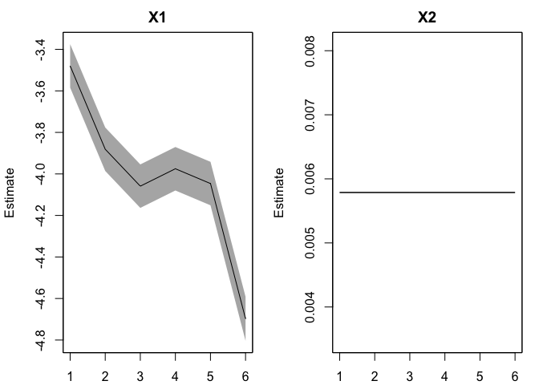

Comparing Model Output
================
2025-01-14

Prompt: d. SAR predictions with no CUI, longest time series possible for
each of the three methods e. Ditto, but using the same start and end
years for each of the three time series f. Same as d, but with CUI g.
Same as e, but with CUI Then can talk further at next meeting

<!-- -->

``` r
fct_model_single_no_cov<-function(data, index, sar){

  data_train<-data %>% 
  filter(sar.method == !!sar, 
         index == !!index) %>% 
  drop_na() %>% 
    select(-c(index, value))

  years <- data_train$year
  ## number of years of data
  TT <- length(years)
  ## get response variable: logit(survival)
  dat <- matrix(data_train$logit.s, nrow = 1)

  ## number of regr params: slope 
  m <- 1 #changed to intercept only


  ### build DLM

  ## for process eqn
  B <- diag(m)                        ## 2x2; Identity -> changed to 1x1
  U <- matrix(0, nrow = m, ncol = 1)  ## 2x1; both elements = 0 -> changed to 1x1
  Q <- matrix(list(0), m, m)          ## 2x2; all 0 for now -> changed to 1x1
  diag(Q) <- c("q.alpha")   ## 1x1; diag = (q1) #-> changed to only include alpha

  ## for observation eqn
  A <- matrix(0)               ## 1x1; scalar = 0
  R <- matrix("r")             ## 1x1; scalar = r

  ## only need starting values for regr parameters
  inits_list <- list(x0 = matrix(c(0), nrow = m))

  ## list of model matrices & vectors
  mod_list <- list(B = B, U = U, Q = Q, A = A, R = R) 


  ### fit DLM
  # set.seed(1234)
  ## fit univariate DLM
  dlm_train <- MARSS::MARSS(dat, inits = inits_list, model = mod_list)
  # DLM: the matrix of states(x) contains the estimates of the regression parameters (θ). Therefore, we need to look in dlm_1$states for the MLEs of the regression parameters, and in dlm_1$states.se for their standard errors.
  
  return(
    dlm_train = dlm_train
  )
}
```

``` r
fct_model_single<-function(data, index, sar){
  data_train<-data %>% 
  filter(sar.method == !!sar, 
       index == !!index) %>% 
  drop_na()
  
  data_new <- data %>% 
  filter(sar.method == !!sar, 
         index == !!index)
  
    
 years <- data_train$year
  ## number of years of data
  TT <- length(years)
  ## get response variable: logit(survival)
  dat <- matrix(data_train$logit.s, nrow = 1)

  ## get predictor variable
  index <- data_train$value

  ## ## ## z-score the upwelling index
  index_z <- matrix((index - mean(index)) / sqrt(var(index)), nrow = 1)

  index_z_train <- index_z[1:TT]

  ## number of regr params (slope + intercept) = 2
  m <- dim(index_z)[1] + 1

  ### build DLM

  ## for process eqn
  B <- diag(m)                        ## 2x2; Identity
  U <- matrix(0, nrow = m, ncol = 1)  ## 2x1; both elements = 0
  Q <- matrix(list(0), m, m)          ## 2x2; all 0 for now
  diag(Q) <- c("q.alpha", "q.beta")   ## 2x2; diag = (q1,q2) #

  ## for observation eqn
  Z <- array(NA, c(1, m, TT))  ## NxMxT; empty for now
  Z[1,1,] <- rep(1, TT)        ## Nx1; 1's for intercept
  Z[1,2,] <- index_z             ## Nx1; predictor variable
  A <- matrix(0)               ## 1x1; scalar = 0
  R <- matrix("r")             ## 1x1; scalar = r

  ## only need starting values for regr parameters
  inits_list <- list(x0 = matrix(c(0,0), nrow = m))

  ## list of model matrices & vectors
  mod_list <- list(B = B, U = U, Q = Q, Z = Z, A = A, R = R) 


  ### fit DLM
  # set.seed(1234)
  ## fit univariate DLM
  dlm_train <- MARSS::MARSS(dat, inits = inits_list, model = mod_list)
  # DLM: the matrix of states(x) contains the estimates of the regression parameters (θ). Therefore, we need to look in dlm_1$states for the MLEs of the regression parameters, and in dlm_1$states.se for their standard errors.

  ## forecast
  forecast_df<-MARSS::forecast(dlm_train, h= 1, newdata = list(z = data_new[nrow(data_new),4], y = data_train[nrow(data_train),2]), type = "ytT", interval = "confidence", fun.kf = "MARSSkfss") #forecasting using the last year survival with new covariate data
  print(paste("New data: covariate data ", forecast_df$newdata$z, "with last survival", forecast_df$newdata$y))
  
  return(list(
    dlm_train = dlm_train,
    forecast_df = forecast_df)
  )

}
```

# d. SAR predictions with no CUI, longest time series possible for each of the three methods

``` r
fit_no_cov_sw<-fct_model_single_no_cov(data = sar_raw_data, index = "CUI", sar = "Scheuerell and Williams (2005)") 
```

    ## Success! abstol and log-log tests passed at 20 iterations.
    ## Alert: conv.test.slope.tol is 0.5.
    ## Test with smaller values (<0.1) to ensure convergence.
    ## 
    ## MARSS fit is
    ## Estimation method: kem 
    ## Convergence test: conv.test.slope.tol = 0.5, abstol = 0.001
    ## Estimation converged in 20 iterations. 
    ## Log-likelihood: -44.22053 
    ## AIC: 94.44107   AICc: 95.07265   
    ##  
    ##           Estimate
    ## R.r          0.197
    ## Q.q.alpha    0.172
    ## x0.x0       -3.426
    ## Initial states (x0) defined at t=0
    ## 
    ## Standard errors have not been calculated. 
    ## Use MARSSparamCIs to compute CIs and bias estimates.

``` r
fit_no_cov_dart<-fct_model_single_no_cov(data = sar_raw_data %>% filter(between(year, 2002,2021)), index = "CUI", sar = "DART") #if include 2000 & 2001 results are nonsense
```

    ## Success! algorithm run for 15 iterations. abstol and log-log tests passed.
    ## Alert: conv.test.slope.tol is 0.5.
    ## Test with smaller values (<0.1) to ensure convergence.
    ## 
    ## MARSS fit is
    ## Estimation method: kem 
    ## Convergence test: conv.test.slope.tol = 0.5, abstol = 0.001
    ## Algorithm ran 15 (=minit) iterations and convergence was reached. 
    ## Log-likelihood: -22.83268 
    ## AIC: 51.66535   AICc: 53.16535   
    ##  
    ##           Estimate
    ## R.r          0.166
    ## Q.q.alpha    0.296
    ## x0.x0       -5.008
    ## Initial states (x0) defined at t=0
    ## 
    ## Standard errors have not been calculated. 
    ## Use MARSSparamCIs to compute CIs and bias estimates.

``` r
fit_no_cov_cjs<-fct_model_single_no_cov(data = sar_raw_data, index = "CUI", sar = "CJS")
```

    ## Success! abstol and log-log tests passed at 26 iterations.
    ## Alert: conv.test.slope.tol is 0.5.
    ## Test with smaller values (<0.1) to ensure convergence.
    ## 
    ## MARSS fit is
    ## Estimation method: kem 
    ## Convergence test: conv.test.slope.tol = 0.5, abstol = 0.001
    ## Estimation converged in 26 iterations. 
    ## Log-likelihood: -6.348644 
    ## AIC: 18.69729   AICc: 20.03062   
    ##  
    ##           Estimate
    ## R.r         0.0576
    ## Q.q.alpha   0.0227
    ## x0.x0      -3.5258
    ## Initial states (x0) defined at t=0
    ## 
    ## Standard errors have not been calculated. 
    ## Use MARSSparamCIs to compute CIs and bias estimates.

<!-- --><!-- --><!-- -->

# e. Ditto, but using the same start and end years for each of the three time series

``` r
sar_raw_data_00_05<-sar_raw_data %>% 
  filter(year >= 2000 & year <= 2005)

fit_no_cov_sw_00_05<-fct_model_single_no_cov(data = sar_raw_data_00_05, index = "CUI", sar = "Scheuerell and Williams (2005)")
```

    ## Success! abstol and log-log tests passed at 17 iterations.
    ## Alert: conv.test.slope.tol is 0.5.
    ## Test with smaller values (<0.1) to ensure convergence.
    ## 
    ## MARSS fit is
    ## Estimation method: kem 
    ## Convergence test: conv.test.slope.tol = 0.5, abstol = 0.001
    ## Estimation converged in 17 iterations. 
    ## Log-likelihood: -5.384774 
    ## AIC: 16.76955   AICc: 28.76955   
    ##  
    ##           Estimate
    ## R.r         0.0732
    ## Q.q.alpha   0.2351
    ## x0.x0      -3.5294
    ## Initial states (x0) defined at t=0
    ## 
    ## Standard errors have not been calculated. 
    ## Use MARSSparamCIs to compute CIs and bias estimates.

``` r
fit_no_cov_dart_00_05<-fct_model_single_no_cov(data = sar_raw_data_00_05, index = "CUI", sar = "DART")
```

    ## Warning! Abstol convergence only. Maxit (=500) reached before log-log convergence.
    ## 
    ## MARSS fit is
    ## Estimation method: kem 
    ## Convergence test: conv.test.slope.tol = 0.5, abstol = 0.001
    ## WARNING: Abstol convergence only no log-log convergence.
    ##  maxit (=500) reached before log-log convergence.
    ##  The likelihood and params might not be at the ML values.
    ##  Try setting control$maxit higher.
    ## Log-likelihood: -8.137102 
    ## AIC: 22.2742   AICc: 34.2742   
    ##  
    ##           Estimate
    ## R.r        0.88033
    ## Q.q.alpha  0.00108
    ## x0.x0     -5.37536
    ## Initial states (x0) defined at t=0
    ## 
    ## Standard errors have not been calculated. 
    ## Use MARSSparamCIs to compute CIs and bias estimates.
    ## 
    ## Convergence warnings
    ##  Warning: the  Q.q.alpha  parameter value has not converged.
    ##  Type MARSSinfo("convergence") for more info on this warning.

``` r
fit_no_cov_cjs_00_05<-fct_model_single_no_cov(data = sar_raw_data_00_05, index = "CUI", sar = "CJS")
```

    ## Success! abstol and log-log tests passed at 31 iterations.
    ## Alert: conv.test.slope.tol is 0.5.
    ## Test with smaller values (<0.1) to ensure convergence.
    ## 
    ## MARSS fit is
    ## Estimation method: kem 
    ## Convergence test: conv.test.slope.tol = 0.5, abstol = 0.001
    ## Estimation converged in 31 iterations. 
    ## Log-likelihood: -2.073531 
    ## AIC: 10.14706   AICc: 22.14706   
    ##  
    ##           Estimate
    ## R.r         0.0237
    ## Q.q.alpha   0.0787
    ## x0.x0      -3.5579
    ## Initial states (x0) defined at t=0
    ## 
    ## Standard errors have not been calculated. 
    ## Use MARSSparamCIs to compute CIs and bias estimates.

``` r
plot(fit_no_cov_sw_00_05, plot.type = c("fitted.ytT"), silent = TRUE)
title(main = "SAR: Scheuerell and Williams (2005), 2000:2005 with no covariate", line =2)
```

<!-- -->

``` r
plot(fit_no_cov_dart_00_05, plot.type = c("fitted.ytT"), silent = TRUE)
title(main = "SAR: DART, 2000:2005 with no covariate", line = 2)
```

<!-- -->

``` r
plot(fit_no_cov_cjs_00_05, plot.type = c("fitted.ytT"), silent = TRUE)
title(main = "SAR: CJS, 2000:2005 with no covariate")
```

<!-- -->

# f. Same as d (longest time series per SAR), but with CUI

``` r
fit_sw<-fct_model_single(data = sar_raw_data, index = "CUI", sar = "Scheuerell and Williams (2005)") 
```

    ## Success! abstol and log-log tests passed at 115 iterations.
    ## Alert: conv.test.slope.tol is 0.5.
    ## Test with smaller values (<0.1) to ensure convergence.
    ## 
    ## MARSS fit is
    ## Estimation method: kem 
    ## Convergence test: conv.test.slope.tol = 0.5, abstol = 0.001
    ## Estimation converged in 115 iterations. 
    ## Log-likelihood: -40.03813 
    ## AIC: 90.07627   AICc: 91.74293   
    ##  
    ##           Estimate
    ## R.r        0.15708
    ## Q.q.alpha  0.11264
    ## Q.q.beta   0.00564
    ## x0.X1     -3.34023
    ## x0.X2     -0.05388
    ## Initial states (x0) defined at t=0
    ## 
    ## Standard errors have not been calculated. 
    ## Use MARSSparamCIs to compute CIs and bias estimates.

    ## [1] "New data: covariate data  1 with last survival -5.48"

``` r
fit_dart<-fct_model_single(data = sar_raw_data %>% filter(between(year, 2002,2021)), index = "CUI", sar = "DART")
```

    ## Warning! Abstol convergence only. Maxit (=500) reached before log-log convergence.
    ## 
    ## MARSS fit is
    ## Estimation method: kem 
    ## Convergence test: conv.test.slope.tol = 0.5, abstol = 0.001
    ## WARNING: Abstol convergence only no log-log convergence.
    ##  maxit (=500) reached before log-log convergence.
    ##  The likelihood and params might not be at the ML values.
    ##  Try setting control$maxit higher.
    ## Log-likelihood: -17.67405 
    ## AIC: 45.34811   AICc: 49.63382   
    ##  
    ##            Estimate
    ## R.r        0.341755
    ## Q.q.alpha  0.000151
    ## Q.q.beta   0.000127
    ## x0.X1     -5.065193
    ## x0.X2      0.443174
    ## Initial states (x0) defined at t=0
    ## 
    ## Standard errors have not been calculated. 
    ## Use MARSSparamCIs to compute CIs and bias estimates.
    ## 
    ## Convergence warnings
    ##  Warning: the  Q.q.alpha  parameter value has not converged.
    ##  Warning: the  Q.q.beta  parameter value has not converged.
    ##  Type MARSSinfo("convergence") for more info on this warning.

    ## [1] "New data: covariate data  30 with last survival -5.04672415376574"

``` r
fit_cjs<-fct_model_single(data = sar_raw_data, index = "CUI", sar = "CJS")
```

    ## Success! abstol and log-log tests passed at 80 iterations.
    ## Alert: conv.test.slope.tol is 0.5.
    ## Test with smaller values (<0.1) to ensure convergence.
    ## 
    ## MARSS fit is
    ## Estimation method: kem 
    ## Convergence test: conv.test.slope.tol = 0.5, abstol = 0.001
    ## Estimation converged in 80 iterations. 
    ## Log-likelihood: -6.069223 
    ## AIC: 22.13845   AICc: 25.88845   
    ##  
    ##           Estimate
    ## R.r        0.05242
    ## Q.q.alpha  0.01617
    ## Q.q.beta   0.00217
    ## x0.X1     -3.62129
    ## x0.X2      0.09974
    ## Initial states (x0) defined at t=0
    ## 
    ## Standard errors have not been calculated. 
    ## Use MARSSparamCIs to compute CIs and bias estimates.

    ## [1] "New data: covariate data  16 with last survival -4.7345640777115"

    ## MARSSresiduals.tT reported warnings. See msg element or attribute of returned residuals object.

<!-- --><!-- --><!-- --><!-- --><!-- --><!-- -->

    ## MARSSresiduals.tT reported warnings. See msg element or attribute of returned residuals object.

<!-- --><!-- --><!-- -->

# g. Same as e (5 year overlap), but with CUI

``` r
fit_sw_00_05<-fct_model_single(data = sar_raw_data_00_05, index = "CUI", sar = "Scheuerell and Williams (2005)")
```

    ## Warning! Abstol convergence only. Maxit (=500) reached before log-log convergence.
    ## 
    ## MARSS fit is
    ## Estimation method: kem 
    ## Convergence test: conv.test.slope.tol = 0.5, abstol = 0.001
    ## WARNING: Abstol convergence only no log-log convergence.
    ##  maxit (=500) reached before log-log convergence.
    ##  The likelihood and params might not be at the ML values.
    ##  Try setting control$maxit higher.
    ## Log-likelihood: -2.117999 
    ## AIC: 14.236   AICc: NA, number of data points less than K+1   
    ##  
    ##            Estimate
    ## R.r        0.000234
    ## Q.q.alpha  0.118438
    ## Q.q.beta   0.000000
    ## x0.X1     -3.483465
    ## x0.X2      0.328530
    ## Initial states (x0) defined at t=0
    ## 
    ## Standard errors have not been calculated. 
    ## Use MARSSparamCIs to compute CIs and bias estimates.
    ## 
    ## Convergence warnings
    ##  Warning: the  R.r  parameter value has not converged.
    ##  Type MARSSinfo("convergence") for more info on this warning.

    ## [1] "New data: covariate data  -10 with last survival -5.48"

``` r
fit_dart_00_05<-fct_model_single(data = sar_raw_data_00_05, index = "CUI", sar = "DART")
```

    ## Warning! Abstol convergence only. Maxit (=500) reached before log-log convergence.
    ## 
    ## MARSS fit is
    ## Estimation method: kem 
    ## Convergence test: conv.test.slope.tol = 0.5, abstol = 0.001
    ## WARNING: Abstol convergence only no log-log convergence.
    ##  maxit (=500) reached before log-log convergence.
    ##  The likelihood and params might not be at the ML values.
    ##  Try setting control$maxit higher.
    ## Log-likelihood: -7.275058 
    ## AIC: 24.55012   AICc: NA, number of data points less than K+1   
    ##  
    ##            Estimate
    ## R.r        0.660933
    ## Q.q.alpha  0.000659
    ## Q.q.beta   0.000463
    ## x0.X1     -5.377111
    ## x0.X2      0.513712
    ## Initial states (x0) defined at t=0
    ## 
    ## Standard errors have not been calculated. 
    ## Use MARSSparamCIs to compute CIs and bias estimates.
    ## 
    ## Convergence warnings
    ##  Warning: the  Q.q.alpha  parameter value has not converged.
    ##  Warning: the  Q.q.beta  parameter value has not converged.
    ##  Type MARSSinfo("convergence") for more info on this warning.

    ## [1] "New data: covariate data  -10 with last survival -6.18894835164161"

``` r
fit_cjs_00_05<-fct_model_single(data = sar_raw_data_00_05, index = "CUI", sar = "CJS")
```

    ## Warning! Abstol convergence only. Maxit (=500) reached before log-log convergence.
    ## 
    ## MARSS fit is
    ## Estimation method: kem 
    ## Convergence test: conv.test.slope.tol = 0.5, abstol = 0.001
    ## WARNING: Abstol convergence only no log-log convergence.
    ##  maxit (=500) reached before log-log convergence.
    ##  The likelihood and params might not be at the ML values.
    ##  Try setting control$maxit higher.
    ## Log-likelihood: -2.027767 
    ## AIC: 14.05553   AICc: NA, number of data points less than K+1   
    ##  
    ##           Estimate
    ## R.r        0.00301
    ## Q.q.alpha  0.10993
    ## Q.q.beta   0.00000
    ## x0.X1     -3.47994
    ## x0.X2      0.00579
    ## Initial states (x0) defined at t=0
    ## 
    ## Standard errors have not been calculated. 
    ## Use MARSSparamCIs to compute CIs and bias estimates.
    ## 
    ## Convergence warnings
    ##  Warning: the  R.r  parameter value has not converged.
    ##  Type MARSSinfo("convergence") for more info on this warning.

    ## [1] "New data: covariate data  -10 with last survival -4.71977097114028"

``` r
plot(fit_sw_00_05$dlm_train, silent = TRUE, plot.type = c("fitted.ytT", "xtT"))
```

<!-- --><!-- -->

``` r
plot(fit_sw_00_05$forecast_df)
title(main = "SAR: Scheuerell and Williams (2005), 2000:2005 with CUI", line =2)
```

<!-- -->

``` r
plot(fit_dart_00_05$dlm_train, silent = TRUE, plot.type = c("fitted.ytT", "xtT"))
```

    ## MARSSresiduals.tT reported warnings. See msg element or attribute of returned residuals object.

<!-- --><!-- -->

``` r
plot(fit_dart_00_05$forecast_df)
title(main = "SAR: DART, 2000:2005 with CUI", line = 2)
```

<!-- -->

``` r
plot(fit_cjs_00_05$dlm_train, silent = TRUE, plot.type = c("fitted.ytT", "xtT"))
```

<!-- --><!-- -->

``` r
plot(fit_cjs_00_05$forecast_df)
title(main = "SAR: CJS, 2000:2005 with CUI")
```

<!-- -->

------------------------------------------------------------------------

Past information to help diagnose (ignore for now)

Next attempt is using full model (April, September, June) to better
explain noise
